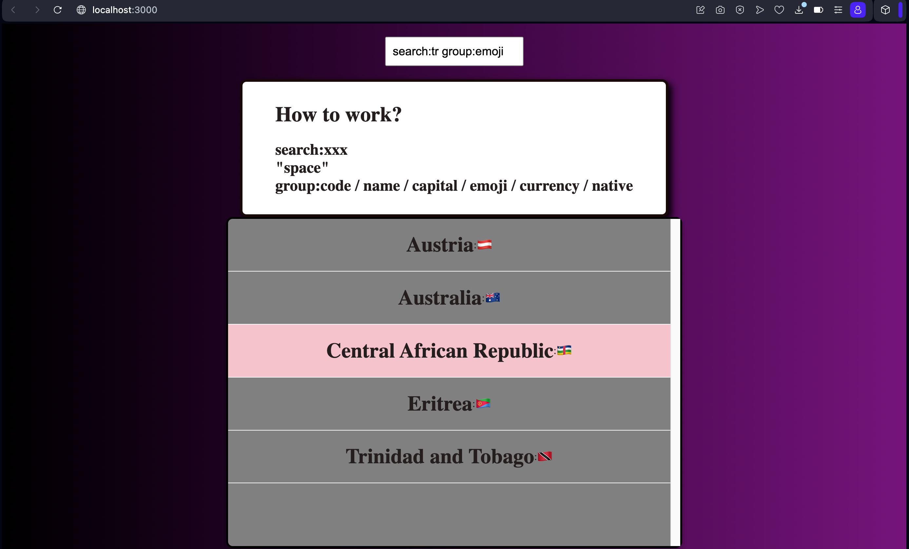

#ENG

##Project Involving Retrieval of Data from the Backend to Query and Filter Information About Countries

###n this project, I have worked on querying and filtering information about countries by retrieving data from the backend.

#TR

##Backend'den Veri Çekme İşlemiyle Ülkeler Hakkında Bilgi Sorgulama ve Filtreleme Projesi

###Bu proje kapsamında, backend'den veri çekerek ülkeler hakkında bilgi sorgulama ve filtreleme işlemi üzerinde çalıştım.

#ENG 

##1. Using Apollo Client, I queried the sample API and listed the data.
##2. I filtered the data in the list using the keywords "search" and "group."
##3. A limit was added to display a maximum of 10 results on the screen.
##4. Each result is clickable, and each click assigns a random color.
##5. If no result is clicked, the last item remains selected.

#TR

##1. Apollo Client kullanarak, örnek API'yi sorgulayarak ve verileri listeleyerek başardım.
##2. Listedeki verileri "search" ve "group" anahtar kelimeleriyle filtreledim.
##3. Ekranda en fazla 10 sonucun görüntülenmesini sağlayacak bir sınırlama ekledim.
##4. Her sonuç tıklanabilir durumda ve her tıklama rastgele bir renk atar.
##5. Eğer hiçbir sonuca tıklanmazsa, son öğe seçili kalmaya devam eder.